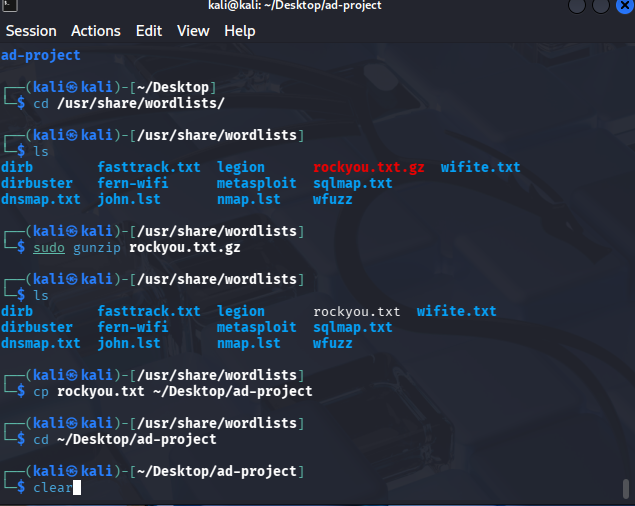
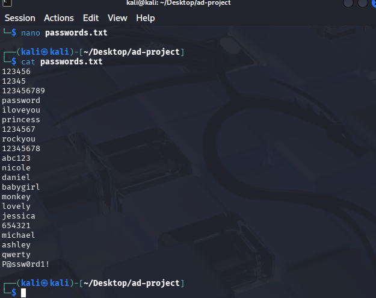
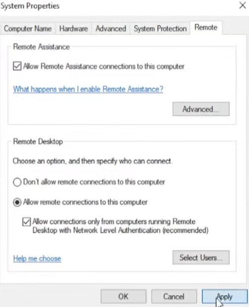
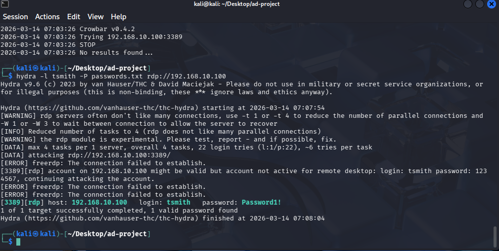
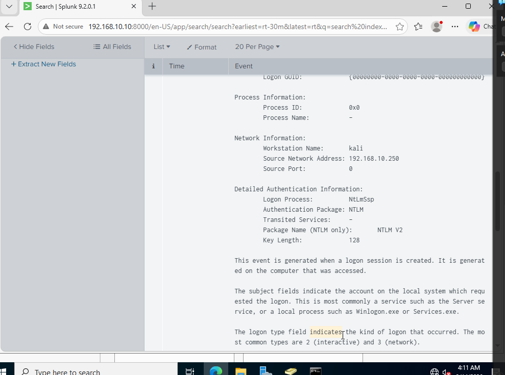
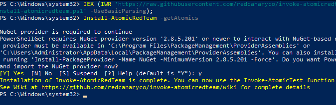
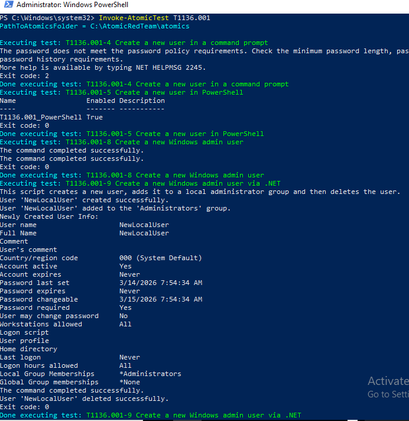

# SIEM Attack Detection Lab

## Overview
This project demonstrates attack simulation and detection within a home lab environment using Kali Linux, Hydra, Splunk, and Atomic Red Team.

The goal was to simulate adversary behavior, generate security telemetry, and investigate the activity in Splunk.

## Wordlist Preparation
A password list was prepared on the Kali Linux attacker machine using the rockyou wordlist.

## Target Configuration
Remote Desktop Protocol (RDP) was enabled on the Windows target machine to support the attack simulation.

## Brute-Force Attack Simulation
An initial attempt was made with Crowbar, but the tool failed due to a missing xfreerdp dependency. The attack was then successfully completed using Hydra.

## Splunk Investigation
The resulting authentication activity was reviewed in Splunk, where the source workstation and source IP were visible in the event details.

## Atomic Red Team
Atomic Red Team was installed on the target system to generate adversary telemetry mapped to MITRE ATT&CK techniques.

## MITRE ATT&CK Test Execution
Atomic Red Team test **T1136.001 (Create Account: Local Account)** was executed to simulate attacker behavior and evaluate detection visibility.

## Skills Demonstrated
- Brute-force attack simulation
- Authentication event analysis
- Splunk-based security investigation
- MITRE ATT&CK adversary emulation
- Endpoint telemetry validation
